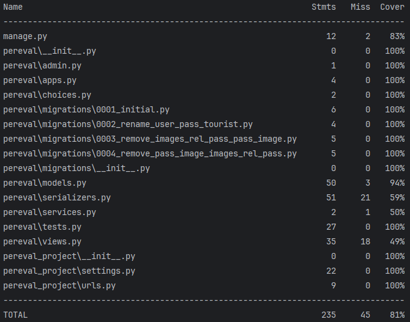

# Виртуальная стажировка


## Pereval Rest API

Федерации спортивного туризма России [pereval.online](https://pereval.online/) (далее - ФСТР) заказала студентам SkillFactory разработать мобильное приложение для Android и IOS, которое упростило бы туристам задачу по отправке данных о перевале и сократило время обработки запроса до трёх дней.

Пользоваться мобильным приложением будут туристы. В горах они будут вносить данные о перевале в приложение и отправлять их в ФСТР, как только появится доступ в Интернет.

Модератор из федерации будет верифицировать и вносить в базу данных информацию, полученную от пользователей, а те в свою очередь смогут увидеть в мобильном приложении статус модерации и просматривать базу с объектами, внесёнными другими.

---
_Турист с помощью мобильного приложения будет передавать в ФСТР следующие данные о перевале:_

* _**Информацию о себе:**_
  * _**Фамилия;**_
  * _**Имя;**_
  * _**Отчество;**_
* _**Электронная почта;**_
* _**Номер телефона.**_
* _**Название объекта;**_
* _**Координаты объекта и его высоту;**_
* _**Уровень сложности в зависимости от времени года;**_
* _**Несколько фотографий.**_

_После этого турист нажимает кнопку «Отправить» в мобильном приложении. Мобильное приложение вызовет метод **Pereval**._

_**Метод:**_

`POST/Pereval/`
_принимает JSON в теле запроса с информацией о перевале. Пример JSON-а:_

```{
    "beauty_title": "пер.",
    "title": "Пхия",
    "other_titles": "Триев",
    "connect": "",
    "tourist": {
        "email": "ivanov@gmail.com",
        "phone": "89457856232",
        "first_name": "Иван",
        "last_name": "Иванов",
        "otc": "Иванович"
    },
    "coord": {
        "latitude": 45.3842,
        "longtitude": 7.1525,
        "height": 1200
    },
    "level": {
        "winter": "1A",
        "spring": "1A",
        "summer": "1A",
        "autumn": "1A"
    },
    "images": [
        {"title": "title1", "image": "https://pereval.ru/image1.jpeg"}, 
        {"title": "title2", "image": "https://pereval.ru/image2.jpeg"}
    ]
}
```

_**Результат метода: JSON**_

* _status — код HTTP, целое число:_

    _500 — ошибка при выполнении операции;_

    _400 — Bad Request (при нехватке полей);_

    _200 — успех._

* _message — строка:_

    _Причина ошибки (если она была);_

    _Отправлено успешно;_

    _Если отправка успешна, дополнительно возвращается id вставленной записи._

    _id — идентификатор, который был присвоен объекту при добавлении в базу данных._

_**Примеры oтветов:**_

`{ "status": 500, "message": "Database connection error","id": null}`

`{ "status": 200, "message": null, "id": 42 }`

_После того, как турист добавит в базу данных информацию о новом перевале, сотрудники ФСТР проведут модерацию для каждого нового объекта и поменяют поле status._

_**Допустимые значения поля status:**_

* _'new';_
* _'pending' — модератор взял в работу;_
* _'accepted' — модерация прошла успешно;_
* _'rejected' — модерация прошла, информация не принята._

---
**_Метод:_**

`GET /Pereval/<id>`

_получает одну запись (перевал) по её id с выведением всей информацию об перевале, в том числе статус модерации._

---
_**Метод:**_

`PATCH /Pereval/<id>`

_позволяет отредактировать существующую запись (замена), при условии что она в статусе "new". При этом редактировать можно все поля, кроме тех, что содержат ФИО, адрес почты и номер телефона. В качестве результата изменения приходит ответ содержащий следующие данные:_

_state: 1 — если успешно удалось отредактировать запись в базе данных. 0 — в отредактировать запись не удалось._

_message: сообщение о причине неудачного обновления записи._

---
_**Метод:**_

`GET /Pereval/?user_id__email=<email>`

_позволяет получить данные всех объектов, отправленных на сервер пользователем с почтой._

В качестве реализации использована фильтрация по адресу электронной почты пользователя с помощью пакета **django-filter**

---
Дополнительно:

1. _Реализовано повторное использование существующего объекта модели `Users` при создания нового объекта модели `Pass`. Если запрос (метод `POST /Pereval/`) на добавление записи отправляет пользователь, ранее уже отправлявший такой запрос (определяется по `email`), то для текущей записи используются ранее записанные данные пользователя, а не создается новый пользователь (объект модели `Users`)._
2. _Для создания и изменения объектов моделей со связанными данными вложенных сериализаторов использован пакет `drf-writable-nested`_

---

_**Проект опубликован на хостинге pythonanywhere.com**_

_**API Pereval**_: https://equestrriann.pythonanywhere.com/Pereval/

_**Документация swagger**_: https://equestrriann.pythonanywhere.com/swagger/ 

_**Документация redoc**_: https://equestrriann.pythonanywhere.com/redoc/

___
_**Отчет о покрытии тестами:**_


